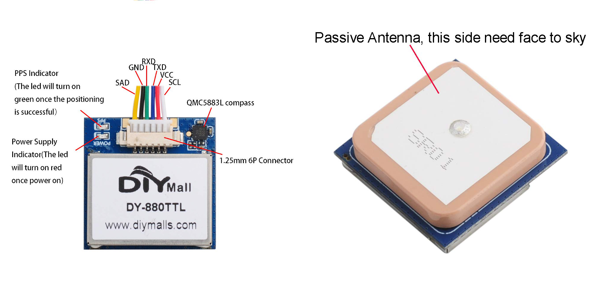
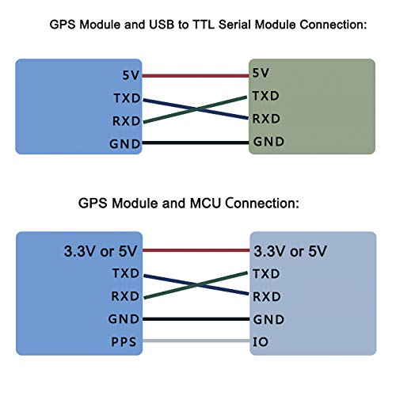
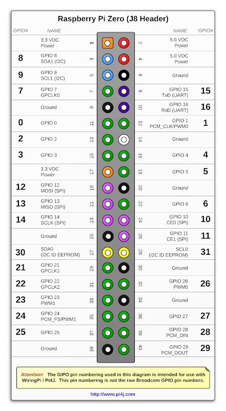
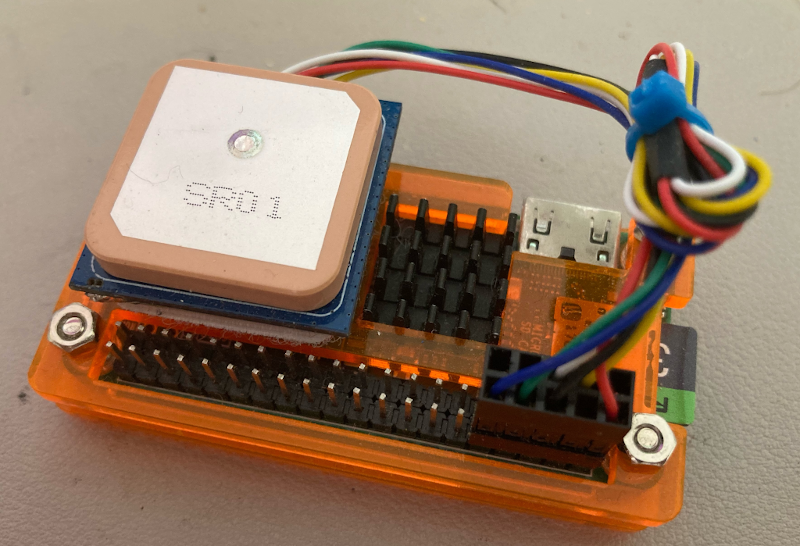
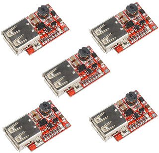
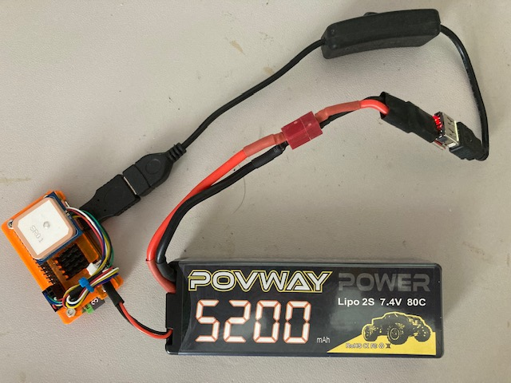
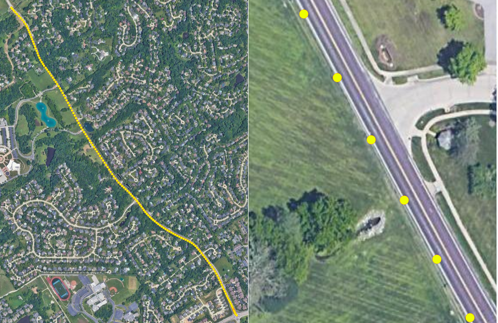

# DIYMall DY-880TTL GPS Sensor

## Introduction and hardware wiring 

The DIYMall DY-880TTL GPS module comes with a QMC5883L 3-axis magnet compass, which makes it very popular for drones because we can not only get locations, we can also get the flight directions from it.

back side and antena side:


The DY-880TTL GPS module only costs around $20 on [Amazon DIYMall Store](https://www.amazon.com/DY-880TTL-Antenna-Compass-QMC5883L-Betaflight/dp/B08FWYJ2TF/ref=sr_1_1?crid=2MFT2SBAPYZDP&keywords=DY-880TTL&qid=1659023178&sprefix=dy-880ttl%2Caps%2C134&sr=8-1), besides it also has an advantage of supporting multi-mode output, such as GPS+GLONASS (default), GPS+ Beidou, and GLONASS+ Beidou. In north america cities, it can normally get 10 ~ 12 satellites on average, so its accuracy is around 3 ~ 5m.

In order to let it run and receive GPS data, we need connect it to a raspberry pi or an arduino board. Luckily, I have a raspberry pi zero/Wifi (let's call it Pi-0 in below) sitting on my workbench. Below is the wiring, which is very simple:

DIYMall DY-880TTL pin map:


Raspberry pi zero/Wifi pin map:


- For connecting DY-880TTL's QMC5883L compass to Pi-0, you need connect DY-880TTL's SCL(white) to Pi-0's pin5(SCL1), and connect DY-880TTL's SDA(yellow) to Pi-0's pin3(SDA1). 

- For connecting DY-880TTL GPS to Pi-0, you need connect DY-880TTL's TXD(blue) to Pi-0's pin10(RXD), and connect DY-880TTL's RXD(green) to Pi-0's pin8(TXD).

- For power, DY-880TTL's VCC(red) need to be connected to Pi-0's pin2(VDC), and DY-880TTL's GND(black) need to be connected to Pi-0's pin6(Ground).



---

## Deploy the code to raspberry pi zero/Wifi

Inside your Pi-0, first clone the repo:

```bash
$ git clone https://github.com/yanfuzhou/DY880TTL
```

Then go inside the downloaded repo on your Pi-0 and install python packages (*Note: need sudo privilege here because we need to access I2C interface)

```
$ cd ~/DY880TTL
$ sudo pip install -r requirements.txt
```

Create the data output folder, the gps data and compass data will be output to a csv file in this folder
```bash
$ mkdir /home/pi/data
```

Before start the script, let's wait for 10~20 minutes to let it capture the satellite (*Note: This step is essential). You also need to calibrate the compass before trigging the start. For how to calibrate the compass, please read this at [here](https://github.com/yanfuzhou/raspy-qmc5883l/tree/master/calibration).

For triggering a run

```bash
$ ./dy880ttl.py
```

The script has a limit on how big a csv file that we can generate, the limit is 200Mb. If you want to change this limit, you need to search for this code block in the script

```python
# maximum allowed file size in bytes
max_file_size = 200000000
```

The script also controls how many csv files that we can keep in the output folder, default is 5. If you want to change this number, you need to search for this code block in the script

```python
# maximum allowed number of csv files
max_num_log_csv = 5
```

The csv file has a naming convention like below, for example:

```text
data_2022-05-15_13:25:41.123378.csv
```

And the csv header looks like this:

```text
datetime,latitude,longitude,altitude,altitude_units,num_sats,heading
```
---

## Testing result
For powering the Pi-0 with a DC battery from my RC car. I bought some DC-DC Buck Step Down dc-dc6-20V 12V/20V to 5V 3A USB chargers from [this amazon seller](https://www.amazon.com/HiLetgo-DC-DC-Module-Charger-Arduino/dp/B01HXU1C6U)



Then I soldered the male T-plug on it and connected it with a 5200mAh 7.4V 80C RC Lipo 2S battery



And finally I brought it with me when I was driving to the grocery store, and here is the testing result rendering.  
As you can see in the right picture, the gps point is pretty accurate since it fell onto the curb of the road


 